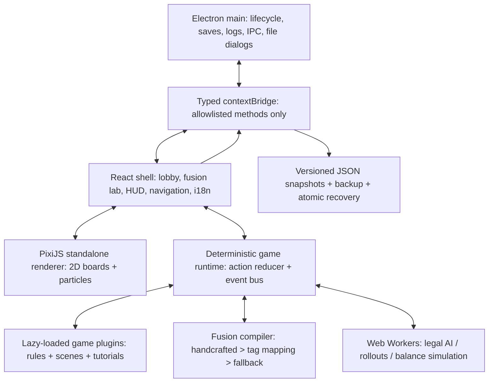

# MASHUP ARENA — Phase 1 Architecture Decision Record
**Status:** Proposed for review · **Baseline:** 2026-10-03 · **Target:** Windows 10/11 x64, entirely offline · **Release version:** 0.1.0 starting Phase 2

## 0. Honest scope and assumptions
This Phase 1 package consists of the design, 38-game catalog, 36 authored fusion specifications (also compiled as TypeScript records), TypeScript architecture contracts, a deterministic RNG utility, a schema-level recipe validator, build/release instructions, and nonfunctional clickable *static* UI wireframes. It is **not** the Electron application and contains **no playable original games**, actual bot AI, or Windows EXE. The user's roadmap explicitly first introduces the EXE in Phase 2, and requests a stop after each phase. No delivery date or Phase 2 completion is represented.

V1: offline single-machine play, hotseat, AI bot play, and local mock multiplayer only. The network abstraction can later be connected to a server; a remote online service is *not* claimed in V1. All chips are virtual; never provide cash purchases, withdrawable tokens, real-money wagering, or payments. Show persistent `For entertainment only · No real-money gambling` notice in every casino screen and anywhere chip wagers are shown. Assets must carry auditable use licenses. For trademarked games such as UNO, implement documented rule fidelity internally while performing branding/legal review before commercial distribution; original shipping artwork and game presentation should not impersonate brand owners. `Property Empire` is original property-trading game design, not Monopoly-branded artwork.

## 1. Component system



**Separation of concerns:** The rule layer is deterministic, pure and headless. Only validated canonical actions enter `reduce()`. A game plugin has no knowledge of Electron, React or PixiJS; its `scene()` returns a render model interpreted by shared Pixi primitives. User intent is translated by a game-specific input controller to an action. The single runtime command dispatcher maintains a game snapshot, revision, seeded RNG state, semantic event journal, and undo boundaries (not available in virtual-chip casino modes). Workers receive serializable, redacted observations; secret opponent cards are never sent to ordinary visible UI or wrong-player AI.

**Required standardized components:** Boards/Zones (`boardType`, coordinate transforms and legal targets), Pieces/Cards/Dice (game-specific entities with JSON serialization), Turn Rules (priority, pass, mandatory actions), Win Conditions (`Outcome`), Events (typed event queue), Resources (virtual chips, Fusion Energy, tokens). Game metadata declares mechanic tags, player count, availability, ruleset version and localized tutorial. For heterogeneous games, plugin-specific data stays private to the plugin; generic fusion works only through adapters.

## 2. TypeScript module and folder contract

Current Phase 1 code:

```text
src/
  contracts/types.ts         JSON-safe GameAction, GameEvent, IGameModule, BotObservation
  contracts/bridge.ts        audited plugin generic erasure with parsed action guard
  contracts/fusion.ts        FusionRecipe, FusionAdapter, EffectProposal, BalanceReport
  contracts/persistence.ts   Profile, SavedMatch, SaveDocument, DesktopBridge
  catalog/gameCatalog.ts     38-game planned catalog, six marked Phase 3
  core/seededRng.ts          deterministic, snapshot/restoreable RNG
  fusion/handcrafted.ts      typed examples for first two fusion specs
  fusion/recipeValidation.ts shallow schema and catalog validation
  fusion/handcraftedSpecs.ts 36 typed design records
  validation/phase1Audit.ts catalog, sample recipe and RNG acceptance test
```

Full Phase 2+ project shape (the directories below are *planned* and must not be confused with implemented code):

```text
mashup-arena/
  electron/main.ts                window, CSP, single-instance, native lifecycle
  electron/preload.ts             narrow validated contextBridge
  electron/persistence.ts         queued atomic writes / migrations / diagnostics
  src/app/                       React routing, shared components, state, i18n
  src/styles/                    token-based theme and locally licensed fonts
  src/runtime/                   reducer, event journal, command dispatcher
  src/fusion/                    compiler, library, effects, diagnostics, dex
  src/games/<game-id>/            per-game plugin, rules, scene adapter, tutorial, AI
  src/workers/                   bot and balance workers
  src/graphics/                  Pixi components, textures, particles, tween scheduler
  src/audio/                     offline sound synthesizer and licensed asset manifest
  src/modes/                     bot, hotseat, daily, survival, local mock transport
  src/progression/               profile, shop, achievements, local rankings
  src/persistence/               typed IPC client, storage fallback, migrations
  tests/unit/ tests/golden/ tests/smoke/ tests/fuzz/
  assets/icons/ assets/fonts/ assets/audio/ assets/textures/
  .github/workflows/             Windows build and packaged-app smoke test
  release/                       generated Windows installer and portable app
```

`RegisteredGame.load()` is a lazy dynamic import returning an audited JSON bridge built using `toGameModuleBridge()`: each plugin validates unknown external actions with `parseAction()` before its strongly typed reducer receives them. In production the registry includes **only finished, passing** plugins. The design metadata's `isReady` must be driven by verified build manifests rather than toggled cosmetically. This prevents nonfunctional visible game buttons in intermediate milestones.

## 3. Module action pipeline and authority

1. Create or restore a deterministic `SessionSnapshot` with game version, RNG snapshot and immutable game state.
2. Check the submitting actor, current phase, action revision and turn owner. Reject stale or unauthorized hotseat actions.
3. Call plugin `validate()` and cross-check against `legalActions()`. An illegal action has no RNG or state side effects.
4. Execute fusion **before-action** proposals where a handcrafted recipe explicitly allows it. A game-specific adapter applies only legal replacements and offers a bounded fallback otherwise.
5. Call pure base `reduce()`, emit immutable standardized events with stable IDs; plugin `outcome()` takes precedence where terminal.
6. Run after-action event handlers in fixed priority order and limited depth, checking invariants after every proposed transition. A terminal result stops further modifications unless its recipe expressly adds *post-game scoring only*.
7. Check completed game, allowed continuation and finite-match watchdog. Snapshot and journal on successful commit, then notify UI and worker pool.

For simultaneous or scoring-only casino modules, canonical `round.ended` events stand in for physical turns. For multiplayer card games (Bridge, Tiến Lên), do not reduce them to an unjustified two-player rule set: support the standard seat count and let one human control one or more seats locally, with bots filling seats.

**Event standard:** `turn.start`, `turn.end`, `card.drawn`, `card.played`, `piece.moved`, `piece.captured`, `dice.rolled`, `bet.placed`, `spin.completed`, `score.changed`, `round.ended`, `game.ended`. Payload shape is game-specific JSON and requires per-type runtime validators at the boundary. Handlers cannot emit an unbounded self-triggering loop.

**Undo:** immutable checkpoints at committed action boundaries; allowed in compatible non-casino practice/hotseat (agreement policy), disallowed for casino hands and ranked/local personal records. Reseeding occurs only when a fresh match begins.

## 4. Fusion Engine: three layers and hard guarantees

**Identity:** Ordered `(baseId, modifierId1[, modifierId2], recipeVersion)`; distinct game IDs. Base controls the board, primary legal actions and original terminal conditions. A modifier contributes a curated subset of tagged events/effects; it does *not* simply glue two complete turn schedulers together. Three-game recipes unlock at level **10** and require two adapters whose effect priorities do not conflict.

**Layer 1 — Handcrafted:** versioned authored recipes take precedence. See `RECIPE_CATALOG.md` for six supplied examples and thirty additional unique pairs. Every rule sheet clearly distinguishes unchanged base rules, imported mechanics and fallback behavior. Human playtests and golden traces are required before releasing a handcrafted card.

**Layer 2 — Automatic mechanic mapping:** tag-to-capability resolution. Determine trigger hooks from source `GameDescriptor.mechanicTags`, choose legal base-game adapter effects with weight by narrative and game type, then compile a declarative script. No eval, remotely supplied scripts or arbitrary callbacks. For missing capabilities, map to a **universal Fusion Energy mini-system**: earn bounded energy from source-like events; spend it to select one of three locally supported side-objectives (score multiplier, vision/hint, one-use bonus reward) at session/round boundaries. A generated fusion must have an observable noncosmetic modifier, even when the base cannot safely accept an extra move. Energy is capped at 3 and scoring bonuses at 10% of tournament side-score. In a standard single-game original-rules variant the overlay stays off.

**Layer 3 — Balance:** seed-swept worker simulations for each recipe and bot difficulty pairing with seat swaps. Track per-seat win rates, nontermination fraction, median turn count, rules-violation count, and first-player bias. Test 24 quick seeded matches asynchronously on initial preview (label report **provisional**), a minimum 200 per promoted generated recipe and 1,000 for prominent handcrafted recipes in a release QA gate, across mirrored seats and multiple seeds. These are engineering acceptance targets, not an implication 1,406 pairs can be exhaustively validated instantly on a player's machine. Cache results by ruleset/recipe/AI version. Auto-adjust only bounded parameter fields (cost, cooldown, chance, bonus magnitude); never auto-mutate base legal rules or call a numeric "fun" metric objectively true. Reject/quarantine recipes failing invariant checks, compiling a safe fallback overlay that itself has tested termination.

**Finite-match policy:** all fusions are **bounded matches**. No effect queue >64 events per player action, nested effect depth >8 (absolute engine cap 16), >3 consecutive bonus turns, or match actions above recipe `maxTurns`. Where the base can naturally conclude, preserve its normal outcome. If there are no legal actions, ask the base plugin for its normal pass/terminal resolution; if neither applies, apply the fusion safety resolver rather than displaying a deadlocked board. At the fusion match cap, determine the result via published base-appropriate measures (Chess material excluding kings, Ludo distance/home count, Go completed territory estimate, casino settled virtual chip result), then a deterministic neutral tiebreak or draw. An action cap is a documented *fusion house rule*, not a change falsely attributed to original Chess, Go etc. Original game mode follows the chosen standard rules, including native draw/termination logic. For card game side-by-side scoring, use fixed legal rounds plus deterministic scoring comparison.

**Invariants:** exactly one legal active turn owner except simultaneous phases; never more than one living king/general on each side in corresponding games; no effect can force a checked king to lose its legal defense; negative virtual bank balances prohibited unless a specific base game's normal insolvency path resolves immediately; move cost/resource spending is transactional; all RNG draws are journaled; all runtime states must pass `assertInvariants()` in testing. The compiler rejects impossible adapter contracts. In action-time failure, deterministic one-energy/no-op fallback is applied once, logged, and cannot recursively trigger itself.

### Chess + UNO handcrafted conflict decisions

1. A normal **legal Chess move** takes place; after it ends (and only if not terminal) the actor draws one fusion effect card.
2. `+2`: restore up to two *already captured* own non-king pieces on available legal original home or eligible return squares. Simulate resulting king safety (both sides), never spawn in check-forcing or king-overlap states; unplaceable restores become capped Energy.
3. `Reverse`: render a 180-degree camera turn and toggle both sides' pawn-forward vectors for future pawn moves. Pawn promotion occurs at the active forward endpoint, not necessarily the initial Chess endpoint. Existing en-passant vulnerability expires using canonical move-based expiry; old pawn double-step remains granted only to eligible unmoved pawns whose current two-square path is legal. No teleportation occurs and king safety is rechecked. This is a **fusion-only** variant, not standard Chess.
4. `Skip`: if the opposing king is in check, skip cannot suppress that side's required legal response, so convert to Energy; otherwise skip a single opposing action. Per-side skip chaining has a cooldown to guarantee play resumes.
5. `Wild`: transform one selected own non-king to Queen/Rook/Bishop/Knight/Pawn after checking resulting position and movement, with max one transformation per actor turn. New king creation is forbidden.
6. `+4`: choose one opposing non-king; the effect proceeds only when the resulting board position keeps both kings in a legal state. No targeting of kings, and no undefined captures of a pinned piece. When no valid target exists, use the fallback.
7. Each effect card is fully consumed; finite deterministic deck, reshuffle discard through stored PRNG state if exhausted. One effect per normal completed turn, no secondary draws triggered by itself.
8. Checkmate/stalemate native terminals take priority; the 180-action fusion safety cap invokes the announced Chess fusion score/draw resolver only if needed.

### Generated pair selection details

For `(base, modifier)` generate a stable `seed = hash(baseId, modifierId, rulesetVersion, dailySeed/recipeId)`; select 1–3 candidate mapped mechanics ordered by safety tier. Preview displays *exact legal effect wording*, not a vague ``random powers`` banner. For base solo modules versus a bot, use **parallel seeded sessions** (same starting conditions, seat-specific RNG substreams) plus end-of-round outcome comparison; do not fabricate a direct board opponent for Klondike, Slots, Scratch Cards or Plinko. Bridge uses four-seat teams and 13-card hands. Compatibility failures are caught during compile, ahead of entering the gameplay scene.

### Recipe sharing and Fusion Dex

- Offline share code `MA1.<base64url(compressed-declarative-JSON)>.<checksum>` with strict 4 KiB decoded length, schema/version/ruleset and known IDs checks. A checksum detects accidental corruption; it is not cryptographic authorship verification. No arbitrary code from imports.
- Allow custom **display name** (escaped text and length limited); mechanical parameters only for explicitly allowed safe recipe variations. Store the stable canonical signature separately from a user nickname.
- Dex stores discovery timestamp, seed, rarity **as a transparent deterministic collectible tier**, provisional/verified balance telemetry, and subjective fun score based only on optional personal 1–5 rating (not implied objective measurement).
- Random Fusion visually spins two **distinct installed and verified** game modules; 3-way Fusion only after level 10. In early milestones show it only if it works on the currently shipped modules.

## 5. Bots and game modes

Worker protocol: `INIT(gameId, rulesVersion, seed)`, `OBSERVE(actor, redactedState, legalActions)`, `CHOOSE(difficulty, budgetMs)`, `CANCEL(revision)`, `BALANCE_SIM(recipeId, seeds)`. IDs/revision numbers drop late responses. Difficulty policy: Easy uniformly samples safe legal moves; Normal uses rules-aware weighted heuristics; Hard uses game-specific minimax/alpha-beta (Chess, Xiangqi, Connect Four), MCTS (Go, Othello, more complex stochastic games where appropriate) or expectimax/Monte Carlo and information-set policies for hidden-information games. The worker must always obey the legal-action list. Hard bot quality is verified by benchmark, not marketed as perfect.

Modes: `vs bot`, `local hotseat`, `practice`, `tutorial`, `offline date-seeded daily`, `survival` (finite escalating random matches, chip/item grants), `online abstraction via mock transport`. The mock exposes a real turn protocol tested with two local endpoints, but user-facing UI labels it "Local simulation" until real networking exists. Daily challenge seed is based on **local calendar date** with ruleset version; repeatable across launches, with a visible note that system-date changes can alter challenges.

## 6. Persistence, recovery, and security

Electron `app.getPath('userData')/mashup-arena/` contains `save-v1.json`, one safe rotating `.bak`, `errors.log`, and `session-journal.jsonl` (max retention). Current phase saves should support app version and plugin ruleset migration; reject unknown data versions with an export/recovery UX instead of destructive overwrite. Serial mutation queue debounces normal snapshots, checkpoints every 10 seconds and on completed actions/navigation/quit, writes to a temporary file, ensures durable write, verifies JSON checksum, and switches the previous good save to `.bak` before replacing. On crash/restart: try main checksum + schema + migration, then verified backup, then replay validated journal if supported, then show explicit "recover previous save" UI. Persist RNG position and pending event boundaries to avoid duplicate rewards on restoration.

Renderer has `contextIsolation: true`, `nodeIntegration: false`, sandbox enabled where preload requirements permit; no blanket IPC send bridge, no external navigation, no unneeded permissions, no runtime CDN. Preload exposes only `DesktopBridge` functions; IPC main handlers validate types, size, origin and path. Strict production CSP + custom app-local scheme (or carefully controlled local file loading) and renderer's `webSecurity` kept on. TypeScript IPC payload validators are generated or mirrored on both ends. Provide localStorage fallback only for web development/preview, with identical SaveDocument migrations and feature flags; desktop `userData` is authoritative in the packaged app.

Desktop UX: Windows 10/11 x64, F11 fullscreen, Esc closes modal first, Ctrl+S manual save, Ctrl+Z conditional undo, H hint, M mute, Alt+F4 quit. Window bounds are stored and clamped to active displays before restoration. Show tiny branded splash until assets and save load; single-instance lock forwards a second launch to primary window; graceful quit requests bounded save flush and logs failure without indefinite hanging. Distinguish system crash from game rules error and route to a safe lobby with recoverable snapshot. Do not send telemetry without opt-in (v1 none).

## 7. Explicit game ruleset decisions (details require per-game QA)

- Chess: FIDE-derived standard moves, castling, en passant, all promotions, check/stalemate, insufficient material, repetition/50 and automatic 75 move rules as applicable in local variants. Chess fusion has its own documented mutations.
- Xiangqi: standard palace/river, horse-leg blocking, cannon screen rules, facing generals, valid perpetual repetition policy defined in rule screen.
- UNO-style color game: standard color/number/action matching, draw-four legality/challenge, 2-player Reverse behavior, reshuffle and terminal scoring; **no house-rule stacking by default**. Branding/art are original pending rights review.
- Blackjack: shoe count, dealer stands on soft 17, ace flexibility, split/double, blackjack 3:2, insurance options documented and unit-tested; pure virtual chips.
- Slots: symbolic reel probability tables, capped bonus spin count, visible virtual paytable, auditable seed replay; outcomes use the documented RNG model.
- Ludo: four pawns, starting roll requirement, safe squares, capture, 6 bonus rule, exact finish, block rule chosen and explicitly documented; optional 2–4 seats with bot fill.
- Go: 19x19 standard, 9x9 practice, territory scoring rules, komi 6.5 in selected variant, superko choice, two consecutive passes and settlement UI.
- Gomoku: freestyle five-in-row as default; forbidden Renju patterns only in separately labeled variant, not misdescribed as default.
- Property Empire: original property game with published finite board, buy/auction/trade, rent, insolvency, finite session scoring to bound offline play.
- Checkers: English draughts 8x8 mandatory captures; optional international variant must not be silently mixed in.
- Othello, Connect Four, Mancala (Kalah), Dominoes (draw dominoes), extended Tic-Tac-Toe (5-in-a-row/variable grid), and Snakes & Ladders: specify board, legal moves, draw/stalemate scoring in their tutorials before activation.
- Backgammon: 24 points, doubling cube optional explicit ruleset, legal bearing-off, hits/bar and Crawford rule if match mode enabled.
- Tiến Lên Miền Nam, Phỏm, Mậu Binh and Xì Dách: publish chosen Vietnamese regional house variations on each tutorial's first screen; do not present one variant as universal across all tables.
- Texas Hold'em: no-limit defined virtual stakes, blinds, side pots, complete hand ranking and action validation.
- Contract Bridge: four players, legal bidding, trump/no-trump tricks, scoring and vulnerability; bot information boundaries enforced.
- Hearts, Klondike Solitaire, Crazy Eights, Cheat, Memory Match, Video Poker, Roulette, Baccarat, Craps, Sic Bo, Keno, Plinko, Dice Arena, Prize Wheel and Scratch Cards: per-module exact paytables, legal actions, stop conditions and short guided tutorial, in both languages.

Each plugin's immutable `rulesetId`/`rulesetVersion` is tested against move and golden-outcome fixtures. Where no singular universal "standard" exists, tutorial states the exact selected ruleset; alternate regional editions are separate options if implemented, never silently conflated.

## 8. UI architecture, performance and accessibility

Style: **Arcade Atelier** (neon casino accents, restrained walnut-table textures) with canvas rendering at 60 FPS target, dynamic resolution for low-end Windows machines, React only for menu/HUD, and sprite atlases for tokens. Pixi stage scales to viewport with fixed logical board coordinates and dynamic resize; controls maintain at least 44px hit targets, focus and descriptive screen-reader companion DOM for board coordinates. Respect OS-reduced-motion plus a manual toggle; high-contrast and 100/115/130% text scaling are first-class modes.

Color tokens: `night #0B1122`, `panel #18243A`, `panel-raised #22324D`, `teal #49E3CB`, `gold #FFD07B`, `orchid #BF8CFF`, `ivory #F5F0E8`, `muted #AFC0CF`, `danger #FF758B`. Use teal for safe actions, gold for reward chips, orchid for Fusion, pink for danger; rely on icons+labels as well as color. Fonts: **Space Grotesk** headings, **Inter** UI (locally bundled only after OFL/license asset verification; fallback Windows Segoe UI). No fonts/CDN in this Phase 1 package. Audio: bundled royalty-free stems subject to proof of license, or synthesized offline WebAudio for clicks, card flips, chips, rolls, roulette tick, match end; mute default is based on saved setting.

Expected screen routes: Home, Library, Game Details, Fusion Lab, Fusion Preview, Match, Tutorial, Profile, Dex, Survival, Challenges, Shop, Settings, Recovery. Route implementation is gated: no "coming soon" route is visible in any shipped intermediate EXE. Pure UI interactions (filter, favorites, mute, profile edit, persistent settings) must genuinely work before being shown.

## 9. Nonfunctional requirements and phase acceptance

**Phase 1:** approve architecture, real TS type-check, 38-entry manifest, six detailed example fusion contracts, 30 additional author-written pair designs, static wireframes and a Windows release/QA plan. There is no EXE in this phase by design.

**Phase 2:** bootable secure Electron+Vite+React+PixiJS app, complete functional shell/profile/settings/favorites/local save/restore, launch smoke marker test, `npm run dev`, `npm test`, `npm run build`, and `npm run dist` producing both `release/MashupArena-Setup-0.1.0.exe` and `release/MashupArena-0.1.0-portable.exe`. Only functional routes and modules are visible. This phase includes actual icon and splash, even if later artwork is refined.

**Phase 3:** all six named game plugins fully playable with original rule fixtures, tutorial, human/bot play, custom Pixi canvas, packaged Windows builds. Standard original rules for each are the release gate.

**Phase 4:** compile/apply/fail-safe tested fusion engine, preview, Dex, recipe codes, first ten certified handcrafted pairs including Chromatic Chess; run automated balance sweeps and release a rebuilt pair of EXEs.

**Phase 5:** remaining 32 independent game plugins, 36 handcrafted pair designs in production once audited, auto-generation for every distinct ordered pair, third-game recipes, advanced game-appropriate bots, daily/survival/shop/achievements. Adding a plugin requires no edits to the game runtime beyond registering the module; adapters are isolated extension points. This is the highest implementation-risk phase, with no claim about a time estimate.

**Phase 6:** tune motion/audio, all localized tutorials and accessibility, final QA tests for every plugin, every ordered pair's compilation and finite-session safety, balance-simulation gates, native packaged app boot on Windows 10/11 x64, portable userData behavior, icon and installer branding, licenses audit, final `README.md`, signed release if certificate is provided. If the gate fails, do not mark the unfinished game visible and do not label an intermediate build "complete".

Release gate per game: legal-move unit suite and fixtures, human UI walkthrough, determinism/replay, start-to-finish worker-versus-worker smoke within watchdog, progress auto-save/restart migration, tutorial VI+EN, keyboard/mouse/touch coverage, browser renderer error checks. Fusion gate: compile all ordered pairs, zero invariant violations on deterministic seeded smoke set, finite-match watchdog, conflict/exception tests, curated-balance report. Packaging gate: both Windows artifacts exist, checksums computed, unpacked application launch emits renderer-ready marker, clean app can be launched twice without duplicate instances, saved game survives restart, no HTTP requests, accessible and contrast-tested HUD.

**Risks and mitigation:** The sheer breadth (38 rules engines and >1,400 ordered fusions) makes this a major multi-release project. Avoid overpromising instant exhaustive balance; separate verified versus provisional content and never surface a recipe that fails safety tests. Other risks: original-game rule variants, copyright/trademark assets, hidden information leaks from bots, NSIS packaging on non-Windows hosts, state migration across plugin updates, and CPU cost of simulation. The implementation should prioritize complete vertical slices over superficially implemented buttons.
