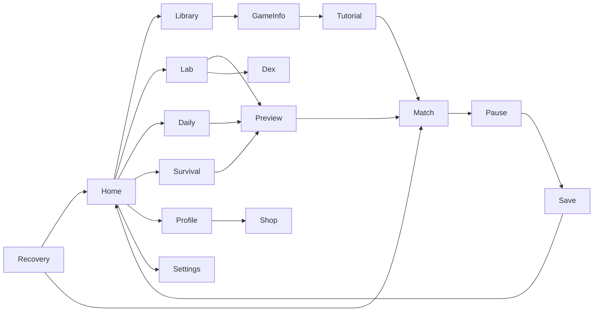

# Phase 1 UX Wireframes and UI Behavior

Open `../preview/index.html` directly in a browser for the matching static concept preview. This is a design mockup, not an interactive game; navigation links switch between static panels. The production app is React (menus) and PixiJS (board), not this HTML prototype.

## Design language: Arcade Atelier
The visual hierarchy is a readable dark control room with subtle warm wooden-table textures. Background `#0B1122`; dark panels `#18243A`; raised surfaces `#22324D`; cyan-teal active actions `#49E3CB`; gold virtual rewards `#FFD07B`; orchid Fusion actions `#BF8CFF`; ivory text `#F5F0E8`; blue-gray secondary `#AFC0CF`; pink error `#FF758B`.

Headings: Space Grotesk, bundled in the *future app* only after licensing verification. General labels: Inter, also local and license-verified. Phase 1 prototype deliberately uses local/system fallbacks and makes **no CDN** calls. HUD uses numerical tabular figures to avoid jitter. Color cannot be the sole communicator: icons, shapes and semantic labels are mandatory. Focus outlines, large targets, adjustable text scale, reduced motion, and persistent VI/EN locale settings are acceptance requirements.

## 1 — Home lobby

```text
┌──────────────────────────────────────────────────────────────────────┐
│ ◈ MASHUP ARENA     Discover | Fusion Lab | Challenges | Profile   ●  │
├──────────────────────────────────────────────────────────────────────┤
│ WELCOME BACK                Chips 2,450  Level 07  35% → Level 08    │
│ MAKE SOMETHING IMPOSSIBLE.  [Enter Fusion Lab →] [Random Fusion]    │
├──────────────────────────────────────────────────────────────────────┤
│ 🔎 Search games…  Board  Card  Casino  Fusion  ★ Favorites          │
│                                                                      │
│   [CHESS]       [COLOR CLASH]     [BLACKJACK]                        │
│   Best moves    Draw + reverse   Virtual chips only                 │
│   [LUDO]        [XIANGQI]        [SLOTS]                             │
│                                                                      │
│ Daily seed challenge  | Last saved game  | Fusion discovery         │
└──────────────────────────────────────────────────────────────────────┘
```

**Interactions (must work when actually implemented):** search title/tags and category chips, favorite toggle persisted in JSON, installed-ready game cards open working detail/tutorial/new game flow, preview doesn't show incomplete games. Daily card requires deterministic local date seed; resume card exists only if recovery payload is valid. No hidden internet fetches.

## 2 — Fusion Lab and preview

```text
┌──────────────────────────────────────────────────────────────────────┐
│ FUSION LAB                        24 known recipes   [Fusion Dex]    │
│ Drag game cards here or click to choose; keyboard offers the same. │
│                                                                      │
│    ┌─────────────────┐           ┌─────────────────┐                │
│    │ A — BASE GAME   │     ⨯     │ B — MODIFIER    │                │
│    │ CHESS           │           │ COLOR CLASH     │                │
│    │ board / victory │           │ draw / reverse  │                │
│    └─────────────────┘           └─────────────────┘                │
│                   [ SYNTHESIZE FUSION ]                             │
├──────────────────────────────────────────────────────────────────────┤
│ REVEAL: CHROMATIC CHESS [Handcrafted]                                │
│ Preserved: Chess check, legal moves, chess victory                   │
│ Imported: draw an effect card after each move                       │
│ Guardrail: checked king cannot be skipped                            │
│ [View full rule sheet] [Copy recipe code] [Start game]                │
└──────────────────────────────────────────────────────────────────────┘
```

**Visual sequence:** pick A and B (slots visually distinguish them); reject duplicate choice with inline explanatory text; progress through 600ms optional reaction particles, reduced-motion instant reveal, 300ms card flip; *never* show a Play button until recipe compilation and safety checks finish. Keyboard/touch fallback is click-to-select from an accessible game picker. Preview includes full inherited ruleset reference, effect table, hard caps, legal fallbacks and bot availability. Long-running provisional balance simulation must not freeze interaction.

## 3 — Game match

```text
┌──────────────────────────────────────────────────────────────────────┐
│ ← Lobby  CHROMATIC CHESS   vs Normal Bot  Turn 12    [?] [☷] [⚙]   │
├──────────────────────────────────────────────────────────────────────┤
│                   BLACK'S HAND / FUSION RESOURCE                    │
│       ┌───────────────────────────────────────────────┐             │
│       │                                               │  MOVE LOG   │
│       │     8 × 8 PixiJS interactive chess board      │  12. Nf3    │
│       │                                               │  11...Qd7  │
│       │   legal squares highlighted and narrated     │             │
│       │                                               │  QUEUE      │
│       └───────────────────────────────────────────────┘  +2 token  │
│                   YOUR HAND + SELECTED PIECE                        │
├──────────────────────────────────────────────────────────────────────┤
│ Your turn: choose a legal piece.    [Hint] [Undo] [Save] [Rules]     │
└──────────────────────────────────────────────────────────────────────┘
```

**Layout:** board gets majority space but never covers HUD. Desktop move log in side rail, narrow window via collapsible drawer; scale board but keep hit areas >=44px where feasible. Keyboard navigation selects coordinates with arrows, Enter selects/moves, Esc cancels; live region announces turn, check, last move and game result. Hints are game-specific legal actions with an explanation. Undo appears only in supported non-casino modes; saved state includes complete RNG and event boundaries. Audio/animations are skippable and disabled by OS/user reduced-motion preference.

## 4 — Profile, progression and settings

```text
┌──────────────────────────────────────────────────────────────────────┐
│ PROFILE               Avatar      LEVEL 07       2,450 virtual chips│
│                            [███████░░░]  70%                       │
├──────────────────────────────────────────────────────────────────────┤
│ STATS           DISCOVERED FUSIONS           ACHIEVEMENTS           │
│ 42 matches      18 / 1,406                  First Fusion            │
│ Win ratio       Verified: 12                Clean Finish            │
├──────────────────────────────────────────────────────────────────────┤
│ COSMETICS: Board finishes | Piece themes | Card backs              │
│ SETTINGS:  [VI | EN] [SFX/Music] [Contrast] [Size] [Reduced motion] │
└──────────────────────────────────────────────────────────────────────┘
```

**Economy:** virtual chips only; cosmetics are local and cannot affect outcome. Never put monetary payment or withdrawal interfaces in the application. Local leaderboard is deterministic profile statistics across locally defined player names; make shared PC privacy boundaries explicit.

## Navigation and state diagram



No broken navigation: each release build exposes only working routes. E.g. Phase 2 Lobby/Profile/Settings/Library may show an accessible **empty-list informational state** if no verified games yet, but there must be no misleading "Play now" control or filler "coming soon" game cards. Phase 3 brings six real game cards and starts gameplay routes.
